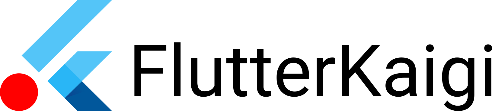

本記事では、FlutterKaigi公式ロゴ、ガイドラインが含まれています。

## 権利表記

© FlutterKaigi Association

本ロゴの著作権はFlutterKaigi Associationに留保します。

## 利用のご案内

主な想定用途は、カンファレンスFlutterKaigiへの協賛の事実を伝えることを中心に、企業紹介におけるロゴ掲載を想定しています。

こちらに記載されてない、たとえば独自のグッズ作成、ロゴの改変（これら例示に限りません）は許可されていません。

なお、Flutterおよび関連するロゴは、Google LLCの商標です。FlutterKaigiは、Google LLCとの提携および、Google LLCが後援しているものでもないことに御留意下さい。

### FlutterKaigi ロゴ例

### その他、連絡事項

ご不明点については、[相談窓口](https://docs.google.com/forms/d/e/1FAIpQLSemYPFEWpP8594MWI4k3Nz45RJzMS7pz1ufwtnX4t3V7z2TOw/viewform)よりお知らせください。
