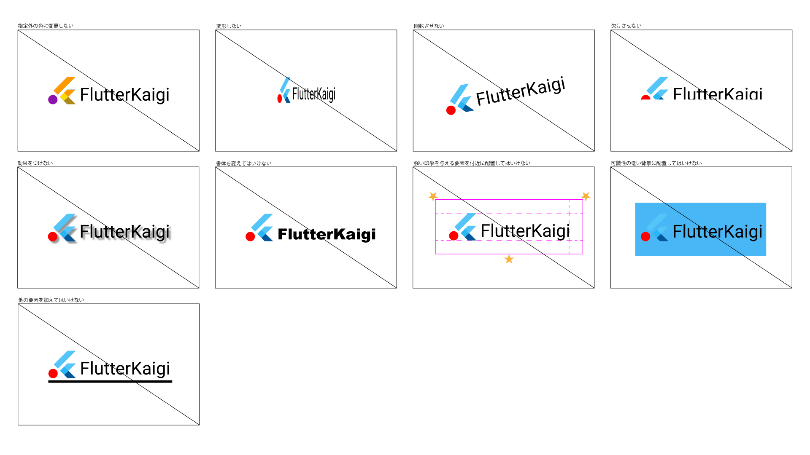

本記事では、FlutterKaigi公式ロゴ、ガイドラインが含まれています。

## 権利表記

© FlutterKaigi Association

本ロゴの著作権はFlutterKaigi Associationに留保します。

## 利用のご案内

主な想定用途は、カンファレンスFlutterKaigiへの協賛の事実を伝えることを中心に、企業紹介におけるロゴ掲載を想定しています。

こちらに記載されてない、たとえば独自のグッズ作成、ロゴの改変（これら例示に限りません）は許可されていません。

なお、Flutterおよび関連するロゴは、Google LLCの商標です。FlutterKaigiは、Google LLCとの提携および、Google LLCが後援しているものでもないことに御留意下さい。

### FlutterKaigi ロゴ例

### アイソレーションエリア
下記はアイソレーションエリアです。 

このエリア内には、他のデザイン要素や文字などを極力配置しないようにしてください。

### 禁止事項
ロゴ画像を下記のように扱うことはNGです。 

ここに記載されている内容以外にもFlutterKaigiが不適切と判断した場合は、使用中止を求める場合があります。

### その他、連絡事項

ご不明点については、[相談窓口](https://docs.google.com/forms/d/e/1FAIpQLSemYPFEWpP8594MWI4k3Nz45RJzMS7pz1ufwtnX4t3V7z2TOw/viewform)よりお知らせください。

2023年10月17日策定
