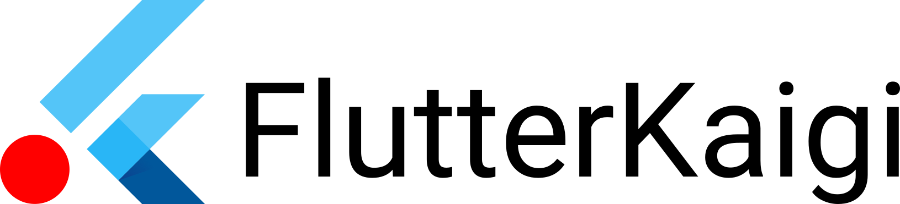

This article contains the official FlutterKaigi logo and its guidelines.

## Rights Statement

© FlutterKaigi Association

The copyright of this logo is reserved by the FlutterKaigi Association.

## Usage Guide

The primary intended use is for displaying the logo in company introductions, mainly to communicate the fact that the company sponsors the FlutterKaigi conference.

Any uses not described here—such as creating original goods or modifying the logo (these examples are not exhaustive)—are not permitted.

Please note that Flutter and the related logo are trademarks of Google LLC. FlutterKaigi is not affiliated with Google LLC, nor is it supported by Google LLC.

### Example of the FlutterKaigi Logo

### Other Notices

If you have any questions, please contact us via the [inquiry form](https://docs.google.com/forms/d/e/1FAIpQLSemYPFEWpP8594MWI4k3Nz45RJzMS7pz1ufwtnX4t3V7z2TOw/viewform).

Established: October 17, 2023